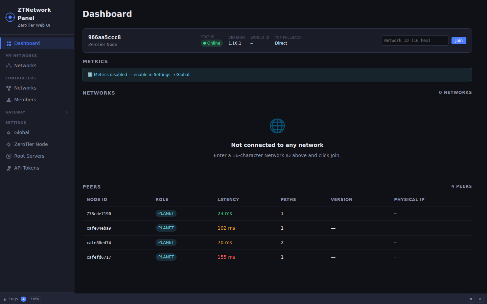
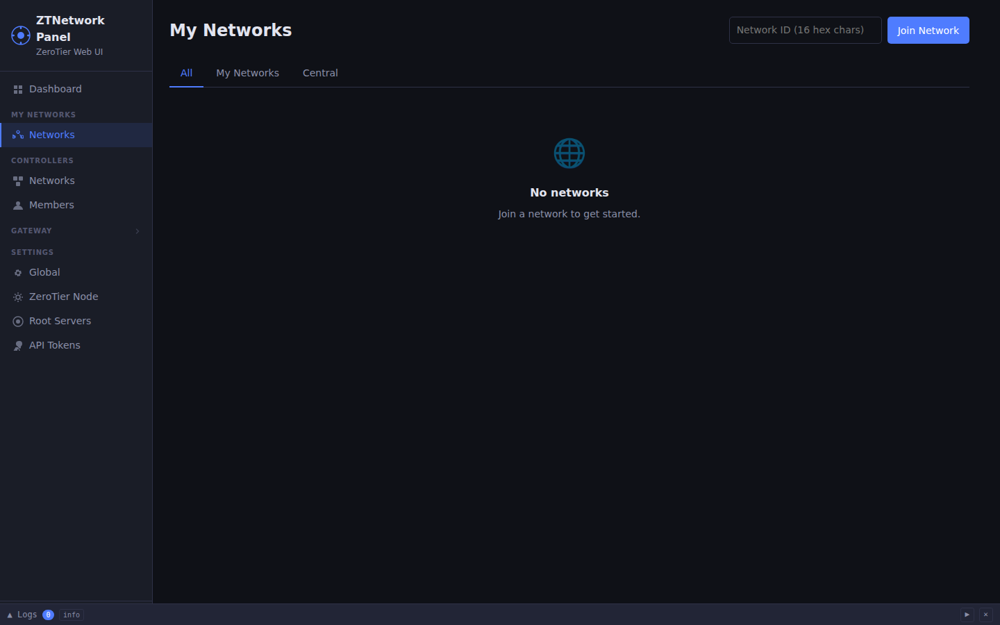
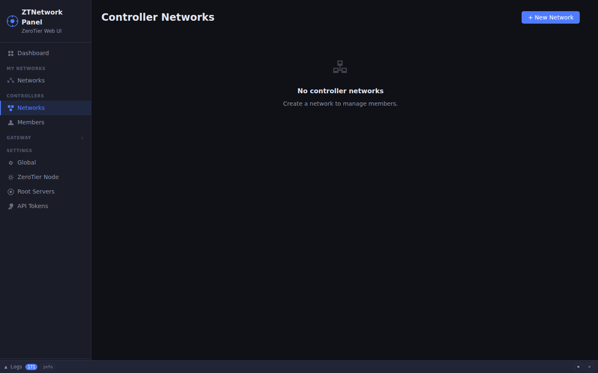
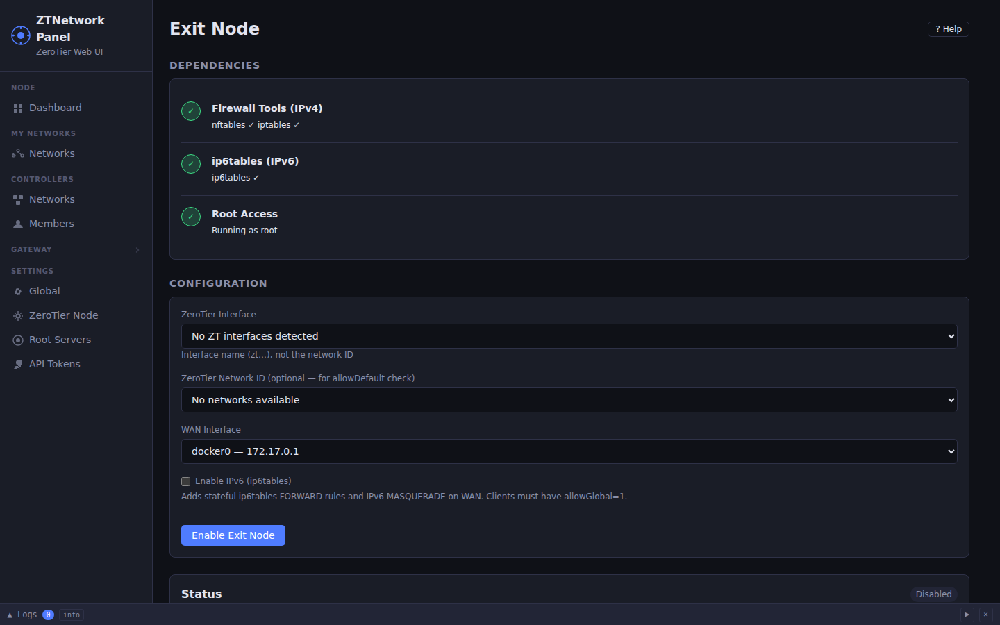
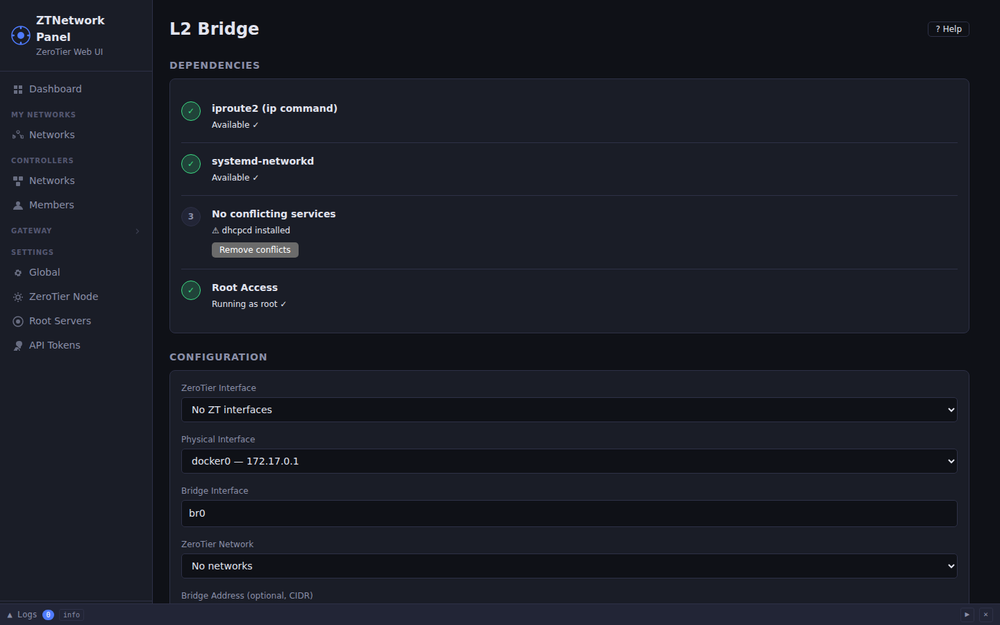
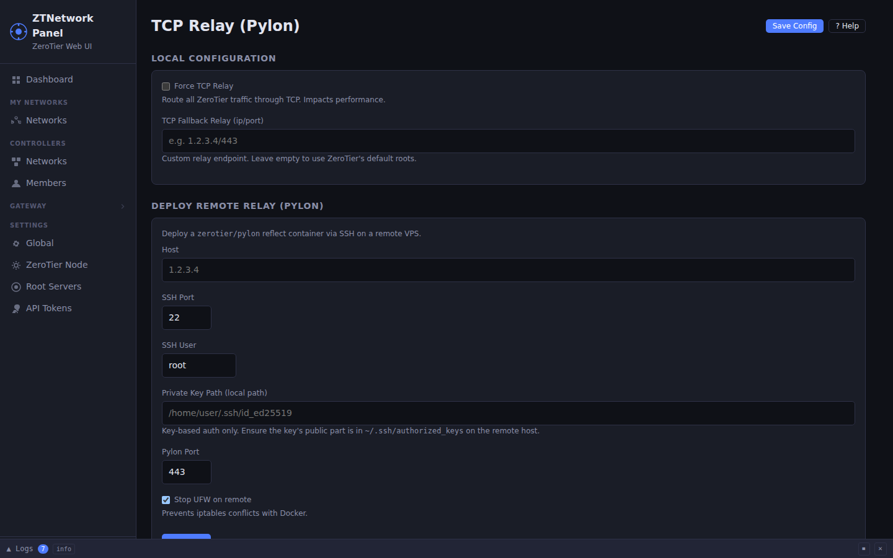
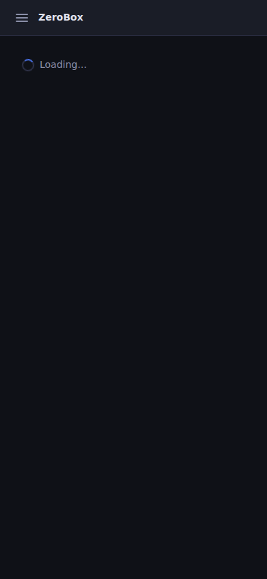

# ztnet-box

**Local web UI for ZeroTier — single self-contained binary.**

Manage your ZeroTier node, networks, and controller entirely through a browser. No cloud account required for local management. No authentication setup, no database, no Node.js — just one Rust binary that starts in milliseconds.

```
./ztnet-box          # → open http://127.0.0.1:3000
```

---

## Features

| Feature | Description |
|---|---|
| **Dashboard** | Node status, peers, metrics graphs, ZeroTier auto-install banner |
| **Networks** | Join/leave Central and local controller networks |
| **Controller** | Full built-in controller: create networks, manage members, authorization |
| **Exit Node** | Route all ZeroTier peer traffic through this machine (full-tunnel VPN) |
| **NDP Proxy** | Native IPv6 exit node via ndppd — no NAT, proper prefix delegation |
| **Physical Routing** | Bridge ZeroTier subnet to a physical LAN via iptables/NAT |
| **L2 Bridge** | Layer-2 bridge between ZeroTier and a physical interface (`ip link`, systemd-networkd) |
| **TCP Relay** | Deploy a `pylon reflect` container on a remote host over SSH; configure local fallback relay |
| **Root Servers** | Manage custom ZeroTier moon/root server definitions |
| **Metrics** | Live Prometheus scraping from ZeroTier's `/metrics` endpoint with charts |
| **Log viewer** | Real-time SSE log stream with level filter and search |
| **Settings** | Edit all config values (server, ZT local, Central tokens, metrics) through the UI |

All state that affects the OS (bridge rules, physnet routes, relay config) is **persisted across restarts** via `~/.local/share/ztnet-box/state.json` (or `/var/lib/ztnet-box/state.json` on system installs).

---

## Requirements

- **ZeroTier One** (`zerotier-one` ≥ 1.10) running on the host — or let ztnet-box install it automatically from the Dashboard
- **Linux, macOS, or Windows** — Exit Node, Physical Routing and L2 Bridge are Linux-only
- **Root privileges** for Exit Node / Bridge features (iptables/nftables/ip link)

---

## Installation

### Pre-built binaries

Download from [Releases](https://github.com/CleoWixom/ztnet-box/releases):

| Platform | Archive |
|---|---|
| Linux x86\_64 | `ztnet-box-x86_64-unknown-linux-gnu.tar.gz` |
| Linux ARM64 | `ztnet-box-aarch64-unknown-linux-gnu.tar.gz` |
| macOS Intel | `ztnet-box-x86_64-apple-darwin.tar.gz` |
| macOS Apple Silicon | `ztnet-box-aarch64-apple-darwin.tar.gz` |
| Windows x64 | `ztnet-box-x86_64-pc-windows-msvc.zip` |

### Debian / Ubuntu (.deb)

```bash
dpkg -i ztnet-box_0.8.0_amd64.deb
systemctl enable --now ztnet-box
```

### RPM (Fedora / RHEL / openSUSE)

```bash
rpm -i ztnet-box-0.8.0.x86_64.rpm
systemctl enable --now ztnet-box
```

### Build from source

Requires Rust 1.75+:

```bash
git clone https://github.com/CleoWixom/ztnet-box.git
cd ztnet-box
cargo build --release
./target/release/ztnet-box
```

---

## Quick Start

```bash
# 1. Copy example config (optional — defaults work out of the box)
cp config.yml.example config.yml

# 2. Run
./ztnet-box

# 3. Open in browser
open http://127.0.0.1:3000
```

For a system-wide install with auto-start:

```bash
sudo cp ztnet-box /usr/bin/
sudo cp pkg/lib/systemd/system/ztnet-box.service /lib/systemd/system/
sudo systemctl enable --now ztnet-box
```

---

## Configuration

`config.yml` is loaded from the **first existing** path among:

1. `./config.yml`
2. `~/.config/ztnet-box/config.yml`
3. `/etc/ztnet-box/config.yml`

All settings are also editable through **Settings → Global** in the UI without touching the file.

### Full reference

```yaml
server:
  host: "127.0.0.1"   # bind address — keep loopback unless behind a reverse proxy
  port: 3000

zerotier:
  local:
    api_url: "http://127.0.0.1:9993"
    token_file: "/var/lib/zerotier-one/authtoken.secret"
  central:
    base_url: "https://api.zerotier.com/api/v1"
    tokens: []           # managed via Settings → API Tokens
    active_token_id: ""  # set automatically when a token is added

metrics:
  enabled: true
  prometheus_url: "http://127.0.0.1:9993/metrics"   # ZT 1.14+
  poll_interval_seconds: 15
  # Auth token for the ZeroTier metrics endpoint (separate from authtoken.secret)
  # See: https://docs.zerotier.com/metrics-monitoring/#metrics-endpoint
  metricstoken_file: "/var/lib/zerotier-one/metricstoken.secret"

exitnode:
  nftables_preferred: true   # true = nftables, false = iptables
```

### Environment variable overrides

| Variable | Config key | Default |
|---|---|---|
| `ZT_SERVER_HOST` | `server.host` | `127.0.0.1` |
| `ZT_SERVER_PORT` | `server.port` | `3000` |
| `ZT_LOCAL_API_URL` | `zerotier.local.api_url` | `http://127.0.0.1:9993` |
| `ZT_LOCAL_TOKEN_FILE` | `zerotier.local.token_file` | `/var/lib/zerotier-one/authtoken.secret` |
| `ZT_CENTRAL_BASE_URL` | `zerotier.central.base_url` | `https://api.zerotier.com/api/v1` |

---

## Security Model

**ztnet-box has no user authentication by design.** The server binds to `127.0.0.1` (loopback only) by default, so it is reachable exclusively from the local machine. This is the same model used by ZeroTier's own local API.

If you change `server.host` to a non-loopback address, ztnet-box logs a warning at startup. In that case, put ztnet-box behind a reverse proxy (nginx, Caddy) with HTTP Basic Auth or mTLS, and restrict access via firewall rules.

### Security properties

- No cookies → CSRF not applicable
- All responses include `X-Content-Type-Options`, `X-Frame-Options`, `Content-Security-Policy`, `Referrer-Policy`
- `Content-Security-Policy: connect-src 'self'` — AJAX requests cannot be exfiltrated off-host
- Request bodies capped at 64 KB
- ZeroTier local client uses `danger_accept_invalid_certs` **only** for loopback connections; remote `api_url` enforces full TLS validation
- SSH relay deploy: key-based auth only (`BatchMode=yes`); `StrictHostKeyChecking=accept-new` protects against MITM after first connect; `ConnectTimeout=15` prevents indefinite hangs on firewalled hosts

---

## Central API Tokens

To manage networks through [ZeroTier Central](https://my.zerotier.com):

1. Open **Settings → API Tokens**
2. Paste a token from [my.zerotier.com/account](https://my.zerotier.com/account)
3. ztnet-box validates the token and auto-detects your rate limit:
   - **Free plan** — 20 req/s
   - **Paid plan** — 100 req/s
4. The first token added becomes active automatically; use **Activate** to switch between multiple accounts

The rate limiter uses a token-bucket semaphore with a per-second refill task. A single `ZtCentralClient` instance is cached per active token — background tasks are not leaked across requests.

---

## Exit Node

Configures this machine as a full-tunnel VPN gateway for ZeroTier peers.

**Requirements:** Linux, root, `iptables` or `nftables`

1. Open **Exit Node** in the sidebar
2. Select the ZeroTier interface (e.g. `zt7nnig26`) and the WAN interface (e.g. `eth0`)
3. Optionally enable IPv6 with a prefix
4. Click **Enable** — ztnet-box applies `MASQUERADE` + `FORWARD` rules, sets `ip_forward`, and persists them for reboot survival

ztnet-box warns if `allowDefault` or `allowGlobal` are not set on the selected network's `local.conf`.

For clients to route all traffic through this exit node, set in their ZeroTier network settings:
- `allowDefault = 1`
- `allowGlobal = 1`

### NDP Proxy (IPv6 without NAT)

For native IPv6 delegation, ztnet-box can install and configure [ndppd](https://github.com/DanielAdolfsson/ndppd) via the Exit Node page. Supports apt, dnf, and pacman.

---

## Physical Network Routing

Routes between a ZeroTier subnet and a physical LAN using iptables NAT + `ip route` policy routing. Follows the [official ZeroTier guide](https://docs.zerotier.com/route-between-phys-and-virt/).

Configure via **Physical Net**: provide the ZeroTier interface, physical interface, and physical subnet in CIDR. ztnet-box generates the iptables rules and prints the required managed route hint to add in ZeroTier Central.

---

## L2 Bridge

Creates a Linux bridge (`br0` by default) between a ZeroTier interface and a physical interface, making ZeroTier peers appear on the physical LAN at Layer 2.

Uses `ip link add … type bridge`, attaches both interfaces, and writes systemd-networkd unit files for persistence across reboots.

---

## TCP Relay (Pylon)

Deploys a [`zerotier/pylon:latest reflect`](https://docs.zerotier.com/relay/) container on a remote server over SSH, then configures the local ZeroTier node to use it as a TCP fallback relay.

**Requirements:** SSH key access to the remote host. Docker is installed automatically via the system package manager if missing.

1. Open **Relay** in the sidebar
2. Enter the remote host, SSH port, user, and path to your private key
3. Set the pylon port (default 443 — traverses most firewalls)
4. Click **Deploy**

SSH options applied: `StrictHostKeyChecking=accept-new`, `BatchMode=yes`, `ConnectTimeout=15`, `ServerAliveInterval=10`, `ServerAliveCountMax=3`.

---

## API Reference

All endpoints are under `/api/`. The UI is served at `/`.

### Local ZeroTier node — `/api/local/`

| Method | Path | Description |
|---|---|---|
| GET | `/status` | Node status and address |
| GET | `/networks` | Joined networks |
| POST | `/networks/:id/join` | Join a network |
| DELETE | `/networks/:id/leave` | Leave a network |
| GET | `/peers` | All peers |
| GET | `/peers/:id` | Single peer |
| GET | `/controller/networks` | Controller network IDs |
| GET/PUT/DELETE | `/controller/networks/:id` | Network details / update / delete |
| POST | `/controller/networks` | Create network |
| GET/PUT/DELETE | `/controller/networks/:id/members/:member` | Member management |
| GET/PUT | `/networks/:id/localconf` | Per-network local.conf |
| GET | `/moons` | Joined moons |
| POST/DELETE | `/moons/:id/orbit` | Orbit / deorbit a moon |
| GET/PUT | `/config` | ZeroTier node local.conf (local settings) |

### ZeroTier Central — `/api/central/`

| Method | Path | Description |
|---|---|---|
| GET/POST | `/networks` | List / create networks |
| GET/PUT/DELETE | `/networks/:id` | Network details / update / delete |
| GET | `/networks/:id/members` | List members |
| GET/PUT/DELETE | `/networks/:id/members/:member` | Member management |
| GET | `/user` | Account info |
| GET | `/status` | API connectivity status |

### Settings — `/api/settings/`

| Method | Path | Description |
|---|---|---|
| GET/PUT | `/config` | ztnet-box config (config.yml) |
| GET/POST | `/tokens` | List / add API tokens |
| PUT/DELETE | `/tokens/:id` | Update (UUID preserved) / delete token |
| POST | `/tokens/validate` | Validate token against Central |
| POST | `/tokens/:id/activate` | Set active token |

### System, Metrics, Logs

| Method | Path | Description |
|---|---|---|
| GET | `/api/system/zt-status` | ZeroTier installation status |
| POST | `/api/system/zt-install` | Install ZeroTier |
| GET | `/api/metrics` | Parsed metrics (JSON) |
| GET | `/api/metrics/raw` | Raw Prometheus text (for external scraping) |
| GET | `/api/metrics/status` | Collector status |
| GET/DELETE | `/api/logs` | Log buffer (last 1000 entries) / clear |
| GET | `/api/logs/stream` | SSE real-time log stream |
| GET/PUT | `/api/logs/level` | Get / set log level |

### Feature endpoints

| Prefix | Verbs | Description |
|---|---|---|
| `/api/exitnode` | status, enable, disable, interfaces, platform | Exit Node |
| `/api/exitnode/ndp` | status, install, enable, disable | NDP Proxy |
| `/api/physnet` | status, enable, disable, platform, deps | Physical Routing |
| `/api/bridge` | status, enable, disable, platform, deps, deps/install | L2 Bridge |
| `/api/relay` | status, local (PUT), deploy, verify, remove | TCP Relay |

---

## Systemd Service

The `.deb` and `.rpm` packages install a ready-to-use systemd unit. Key hardening: `NoNewPrivileges=yes`, `ProtectHome=read-only`, `ProtectSystem=strict` with explicit `ReadWritePaths` for config, iptables, nftables, and sysctl.

```bash
sudo systemctl status ztnet-box
sudo journalctl -u ztnet-box -f
```

---

## Screenshots

| Desktop | Mobile |
|---|---|
|  |  |
|  |  |
|  |  |
|  |  |
|  |  |
|  |  |

---

## Building

```bash
# Debug
cargo build

# Release (LTO, stripped, panic=abort)
cargo build --release

# Tests
cargo test

# Lint (mirrors CI — all warnings are errors)
cargo clippy -- -D warnings

# Format check
cargo fmt --check
```

The frontend is bundled into the binary at compile time by `build.rs`:

- CSS files are concatenated in order: `variables → reset → layout → components → pages`
- JS files are inlined: `api → state → router → components/* → pages/*`
- Everything is embedded into `shell.html` and served from memory

No npm, no webpack, no separate build step beyond `cargo build`.

---

## Project Structure

```
src/
├── main.rs                    # Entry point: config, tracing, metrics, server
├── lib.rs                     # Library crate root
├── runtime_state.rs           # Persist bridge/physnet/relay state across restarts
├── config/
│   ├── schema.rs              # Config structs + serde defaults
│   ├── mod.rs                 # Config loading (file path resolution + YAML parse)
│   └── env.rs                 # Environment variable overrides (ZT_SERVER_HOST, …)
├── server/
│   ├── router.rs              # Axum router, CSP/security headers, static HTML
│   ├── state.rs               # AppState: shared Arc<RwLock<…>> for all subsystems
│   ├── error.rs               # ApiError enum → HTTP status + JSON body
│   ├── validate.rs            # Input validation (network_id, node_id, CIDR, …)
│   ├── middleware.rs          # Request logger (method/path/status/latency_ms)
│   ├── log_collector.rs       # tracing Layer → ring buffer + SSE broadcast channel
│   └── handlers/              # One file per feature area
├── zerotier/
│   ├── local/                 # ZeroTier local API client (HTTP → :9993)
│   ├── central/               # Central API client, rate limiter, token store (cached)
│   ├── local_config/          # local.conf / <network>.local.conf read/write
│   └── detection.rs           # Detect ZeroTier installation
├── exitnode/                  # Exit node: iptables/nftables rules, NDP proxy
├── physnet/                   # Physical network routing (iptables + ip route)
├── bridge/                    # L2 bridge (ip link + systemd-networkd unit files)
├── relay/                     # SSH deploy, pylon relay management
└── metrics/                   # Prometheus scraper, Rust parser, typed cache
www/src/
├── html/shell.html            # SPA shell (router outlet, sidebar, mobile bar)
├── css/                       # variables → reset → layout → components → pages
└── js/
    ├── api.js                 # fetch wrapper with unified error handling
    ├── state.js               # In-memory state store + Utils.esc()
    ├── router.js              # Hash-based SPA router (Router.on / Router.start)
    ├── components/            # LogPanel, Modal, Toast, QRCode, Table
    └── pages/                 # One IIFE module per page
```

---

## Changelog

See [CHANGELOG.md](./CHANGELOG.md).

## License

MIT — see [LICENSE](./LICENSE).
