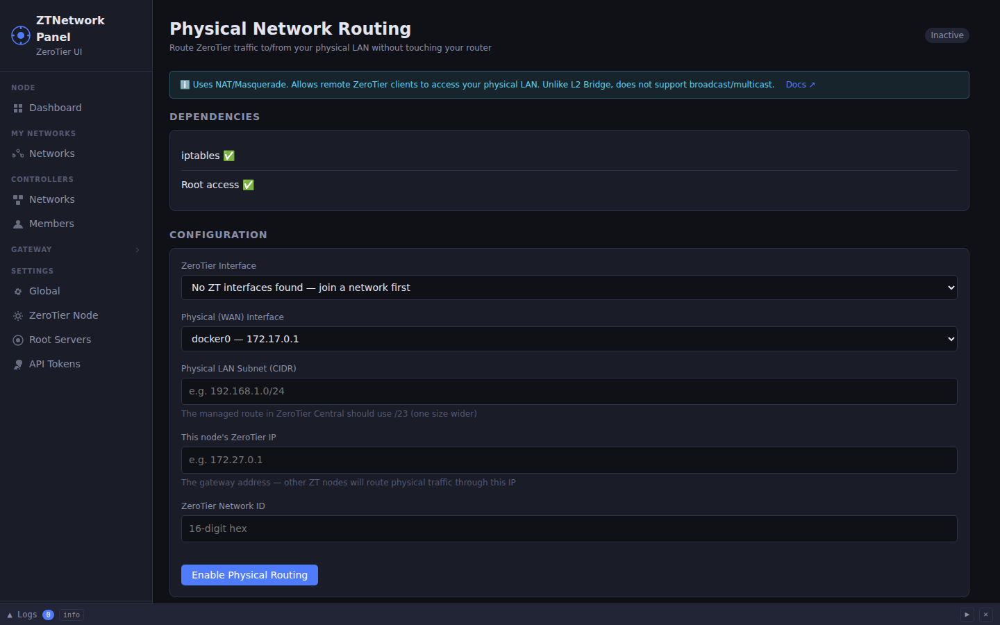
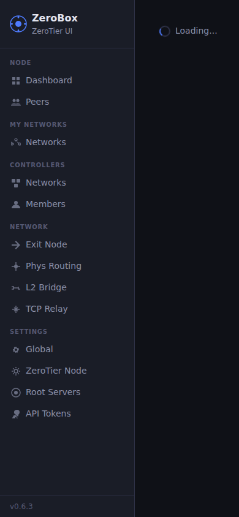
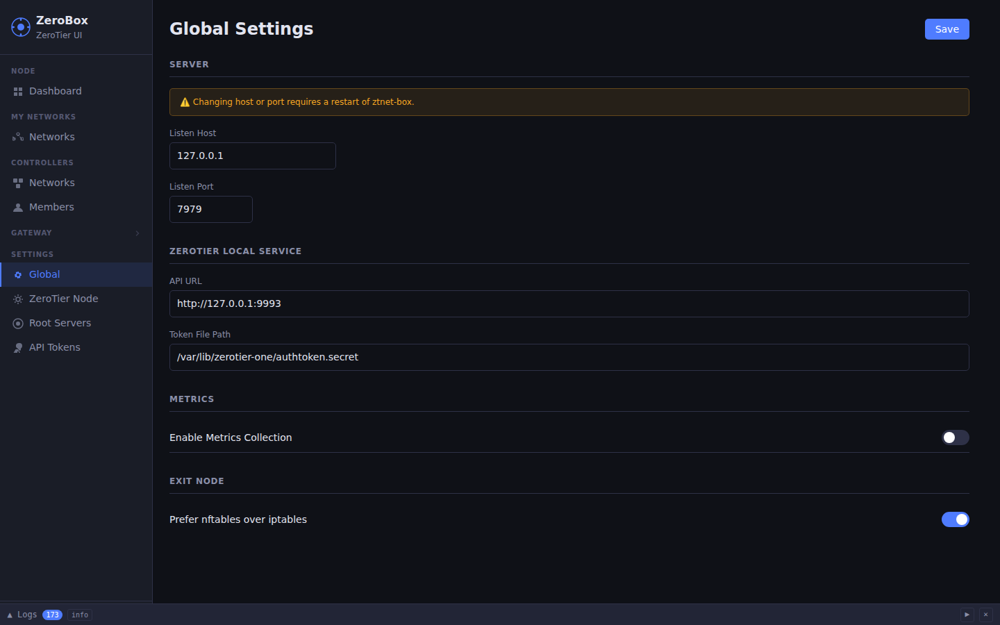
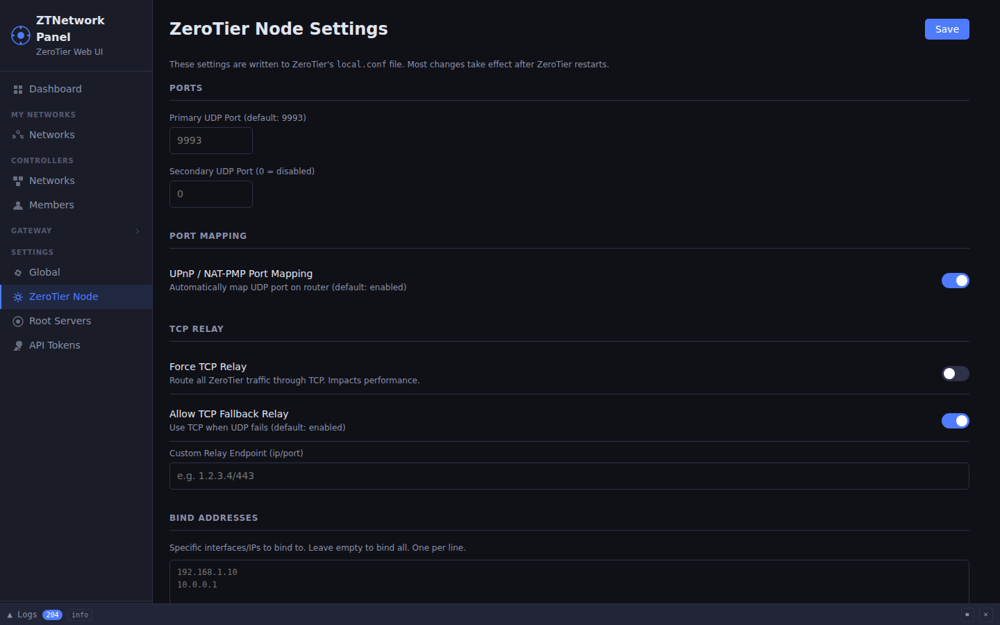
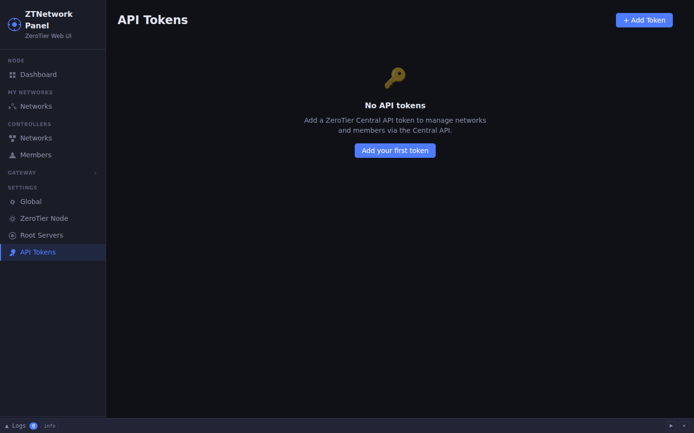

# ztnet-box Screenshots

WebUI screenshots captured automatically via Playwright.  
Updated by the [Screenshots workflow](../../.github/workflows/screenshots.yml) — run `workflow_dispatch` or push to `main` touching `www/src/`.

## Pages

| Page | Desktop (1440×900) | Mobile (390×844) |
|------|--------------------|------------------|
| Dashboard |  |  |
| Networks |  |  |
| Exit Node |  |  |
| Phys Routing |  |  |
| L2 Bridge |  |  |
| TCP Relay |  |  |
| Controllers |  |  |
| Settings — Global |  |  |
| Settings — ZeroTier Node |  |  |
| Settings — API Tokens |  |  |

> Screenshots are placeholders until the first workflow run.
